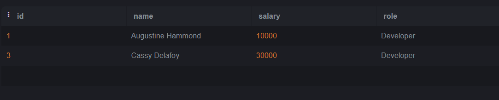

# SQL-Lab2

# We will use the Employees and Awards table below:

 

### Q1: Choose all employees who have received an award (Nested Query)?
Query: SELECT *
 FROM employee 
 WHERE id in ( SELECT employee_id 
             FROM awards) ; 

Output: 
 

### Q2: Choose all employees who have never received an award (Nested Query)?
Query:SELECT *
FROM employee 
WHERE id not in ( SELECT employee_id 
             FROM awards) ; 

Output: 

 
### Q3: Choose all Developers who make more than all Managers combined (Nested Query)?
Query:SELECT *
FROM employee
WHERE role = "Developer" and salary > ( SELECT MAX(salary)
                FROM employee
                WHERE role ="Manager" ); 

Output: 

 
### Q4: Choose all Developers who make more money than any Manager (Nested Query)?
Query:SELECT *
FROM employee
WHERE role = "Developer" and salary > ( SELECT MIN(salary)
                FROM employee
                WHERE role ="Manager" );

Output:

 
### Q5: Choose all employees whose salaries are higher than the average for their position. (Nested Query)?
Query:SELECT *
FROM employee 
where salary > (SELECT AVG(salary)
                FROM employee 
                where role= employee.role ) ;

Output:
